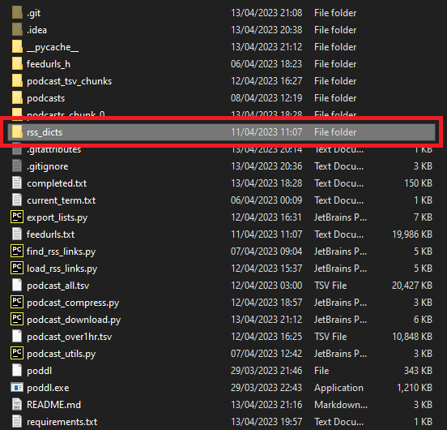

## Intro

This repo contains a copy of the iTunes API Podcast data and scripts to download the 5897k hours of English audio data. 

The iTunes API script uses [this method](https://gist.github.com/eteubert/5986525?permalink_comment_id=3225211#gistcomment-3225211) described by [eteubert](https://gist.github.com/eteubert) and takes approx 7 days to run.

The Podcast Downloader script uses [freshe/poddl](https://github.com/freshe/poddl) and takes an unknown length of time to run. (probably around 3 years for a single machine)

---

## Data

[feedurls.txt](/feedurls.txt) contains a List of Podcast RSS Feeds, extracted via iTunes API on 8th April 2023. This list is 430,888 items long and contains all languages.

[podcast_all.tsv](/podcast_all.tsv) contains the same urls as feedurls.txt but also contains language and duration fields.

Each line in the tsv is `'{feed_url}\t{language}\t{duration}'`

---

[rss_dicts](https://drive.google.com/drive/folders/1lHRXjiksRHv8-WCv6b8gw-MGL2W24avf?usp=share_link) contains the raw API responses for each podcast in JSON format. Due to RAM limits, the data is split into chunks and compressed.

`load()` in load_rss_links.py shows how to load the data into one dict, however be aware that this uses 100GB~ of RAM.

---

[podcast_tsv_chunks](/podcast_tsv_chunks) contains English chunks of the tsv file, split so that each chunk is 1TB of data once downloaded and compressed.

These files are used with the podcast_download.py script.

In total there are;
-  129k Unique English Podcasts
- 5897k hours of English audio
- 69.4TBs of Opus 32kbps files

---

## Scripts

[find_rss_links.py](/find_rss_links.py) contains the script that scrapes the iTunes API for Podcast RSS feeds.

[load_rss_links.py](/load_rss_links.py) contains the script that loads all the RSS feeds into a single dict.

[export_lists.py](/export_lists.py) contains the script that exports the data into tsv and txt files.

[podcast_download.py](/podcast_download.py) contains the script that downloads the tsv chunks into `podcasts_chunk_{id}` folders

[podcast_compress.py](/podcast_compress.py) contains the script that compresses the downloaded media files to `.opus` 32kbps mono format to save space.

---

## Usage
#### (downloading podcasts)

1. Download [rss_dicts](https://drive.google.com/drive/folders/1lHRXjiksRHv8-WCv6b8gw-MGL2W24avf?usp=share_link) and put the `rss_dicts_chunk_{id}.json.gz` files inside a folder called `rss_dicts`.

2. Run `python podcast_download.py --start_chunk=0 --final_chunk=0` to download the first chunk. (This is around 4TB of data)

3. Run `python podcast_compress.py` to convert any media files in the repo to `.opus` 32kbps mono format. (this reduces the size per chunk from 4TB to 1TB but takes  a while to run).

Both scripts can be ran at the same time.

The files will be downloaded to `podcasts_chunk_{id}` folders inside the repo.